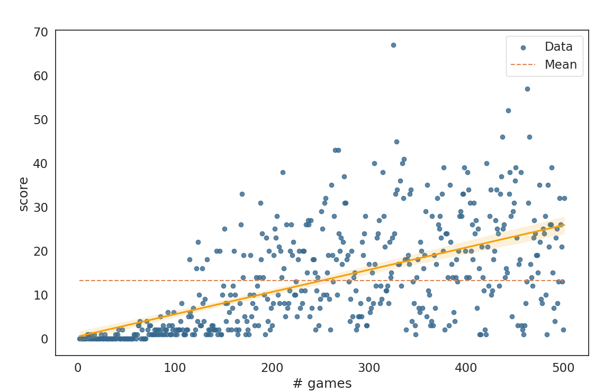
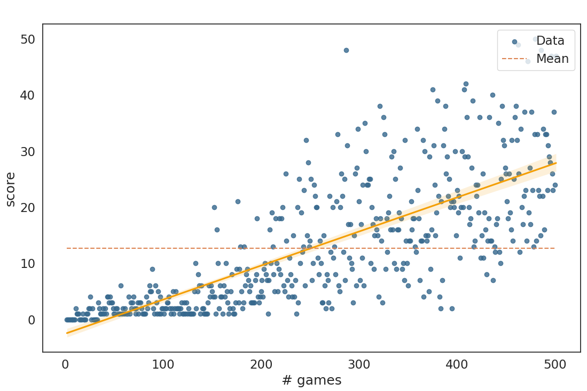
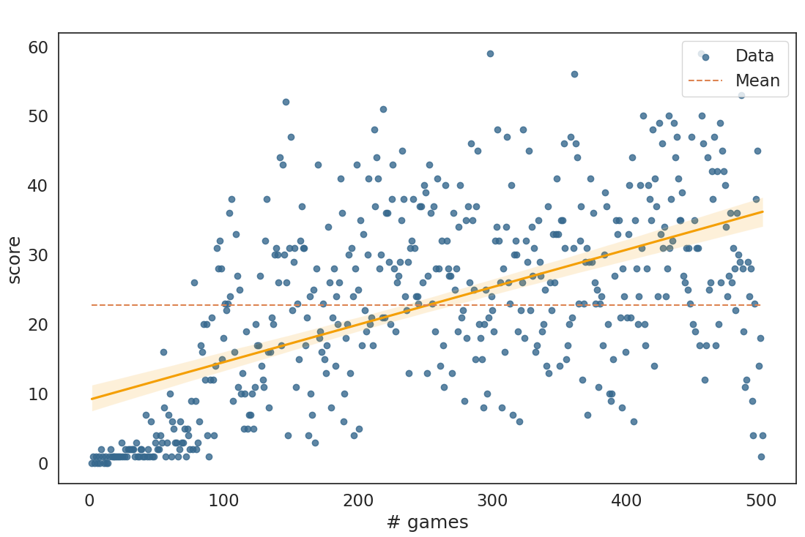

# RL practice
This repository contains a set of algorithms and gyms for educational purposes and reinforcement learning experiments. The primary goal is to implement everything from scratch to gain a deeper understanding of RL.

<p align="center">
  
  
</p>

Algorithms:
 - DQN
 - DoubleDQN
 - DuelingDQN

GYMs:
 - Snake

TODO:
 - RainbowDQN implementation
 - Platformer environment
 - PPO (Proximal Policy Optimization) implementation

## Install
Use python 3.10 and following packages:
```
$ pip install -r requirements.txt
```


## HOWTO

Run script:
```
$ python run.py --param_file YOUR_PARAM_FILE --mode train --plot_results --display
```
For example 
```
python run.py --param_file ./configs/double_dqn_snake.yaml --mode train --plot_results --display
```
Parameters_search:
```
python run.py --param_file ./configs/double_dqn_snake.yaml --mode parameters_search
```
Test:
```
python run.py --param_file ./configs/double_dqn_snake.yaml --mode test --display
```
### Results
<p align="center">
  <div style="display:inline-block; text-align:center; margin: 10px;">
    <p>DQN Result</p>
    
  </div>
  <div style="display:inline-block; text-align:center; margin: 10px;">
    <p>Double DQN Result</p>
    
  </div>
  <div style="display:inline-block; text-align:center; margin: 10px;">
    <p>Dueling DQN Result</p>
    
  </div>
</p>